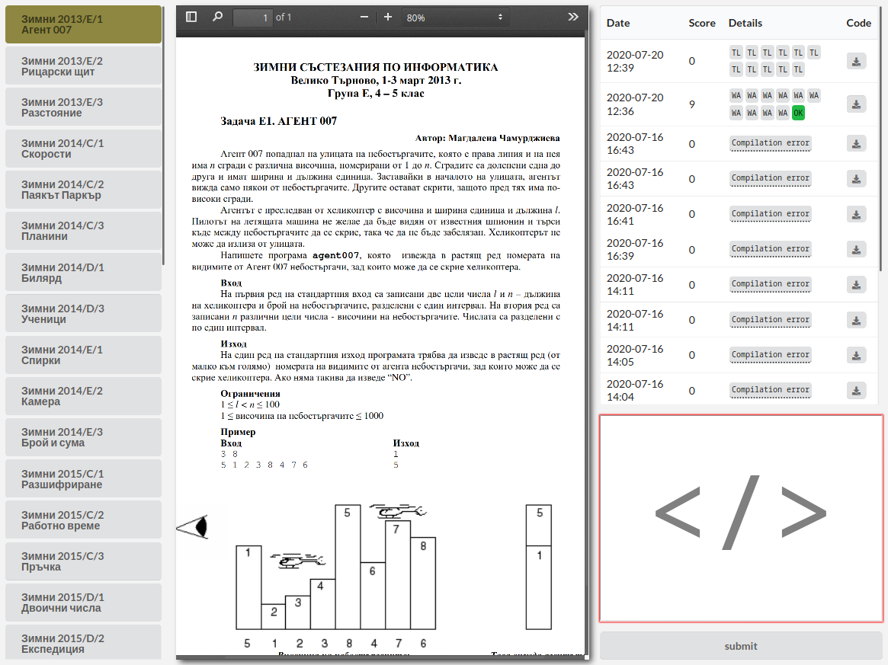

## J2 - Competitive programming judge system for bootcamps

Features:
  * Batteries included: Comes with prepulated database with enough problems for multiweek bootcamps
  * Zero friction: does not need logins or connection to the internet
  * Zero management: no need to configure anything - up and running in seconds!
  * Not insecure: Uses sandbox for all submissions



## Setup
```
git clone https://github.com/StanislavNikolov/J2
cd J2
npm install
node index.js # start system
```
Then go to http://localhost:8080

## Admin interface
Go to http://localhost:8080/admin. Allows connections only from the loopback device, so other users on the same network won't be able to change anything. Here you can:
 * Change which problems are visible
 * See all submissions and change usernames. Don't have any kind of authentication, just a random token allowing you to connect submissions with names. Users changing their browser will have a new token, thus effectivly "registering" again
 * Enable / disable ranking

### TODO
  * Implement standings with userKey to username mappings
  * Add "view all submissions" list in admin
  * Add ladders so that it's easy to configure the judge in "we are practising string problems today" mode
  * Add "create task" button
  * Add different score calculation modes, for example: "binary", "codegolf", "memorygolf", "relative"
  * Implement "download" button in submission list
  * Test under "windows" - probably different sandboxing method needed
